

     
    
     

  
    
    
  
  
  

<h4 align="center">
    
一款通过微信小程序管理微博的小工具

</h4>

## 项目梗概

- 基于微信小程序的前端页面，同时提供了连接后端的接口方法
- 包含四个界面，可实现小程序登录、微博账号登录及管理、微博任务管理以及执行微博任务

## 使用方法

- 下载项目后导入微信开发者工具，即可进行编译或更改源码

## 注意事项

- 使用源码时，注意更改前端接收后端的数据类型及格式

## 前端页面展示

### 登录页面及主界面

   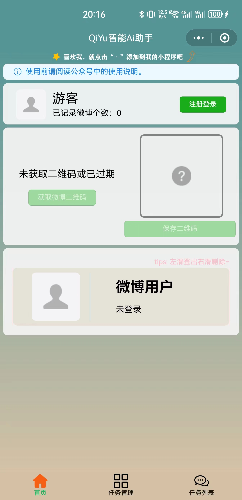 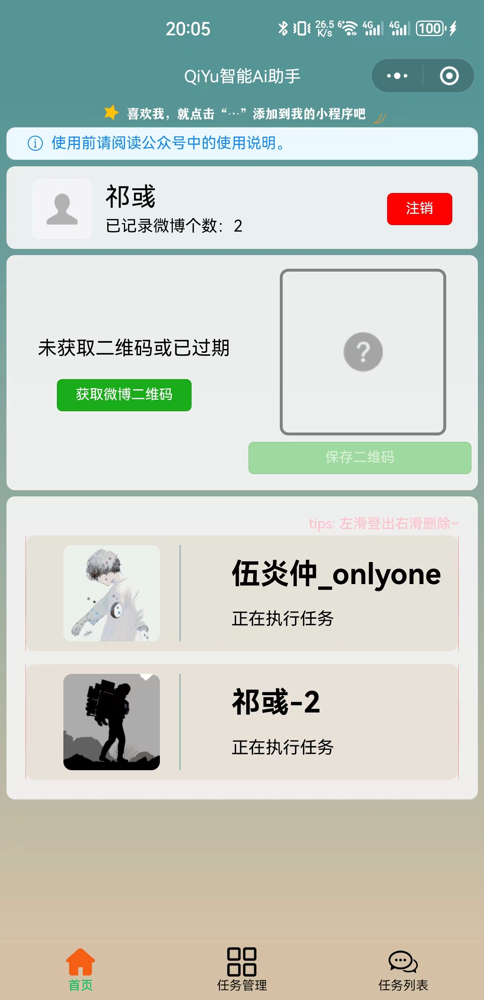

### 任务列表及任务管理页面

  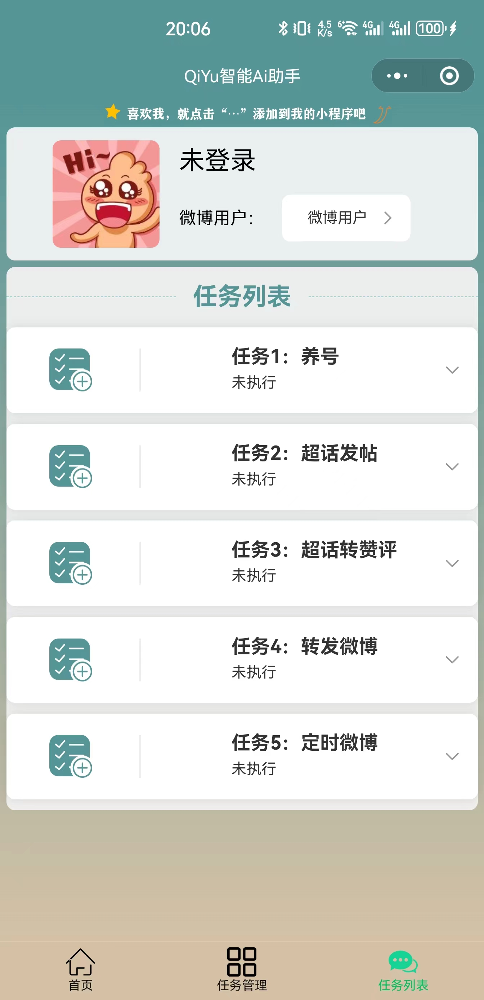 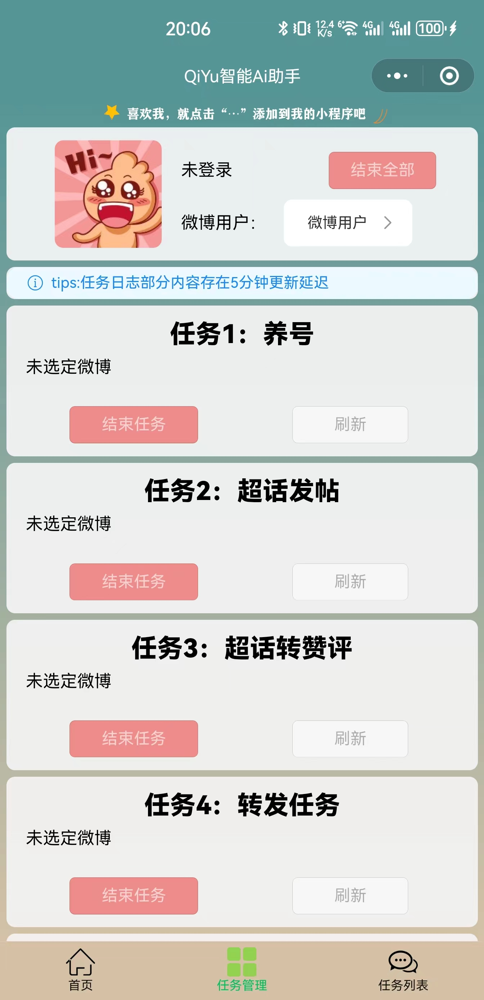

        

  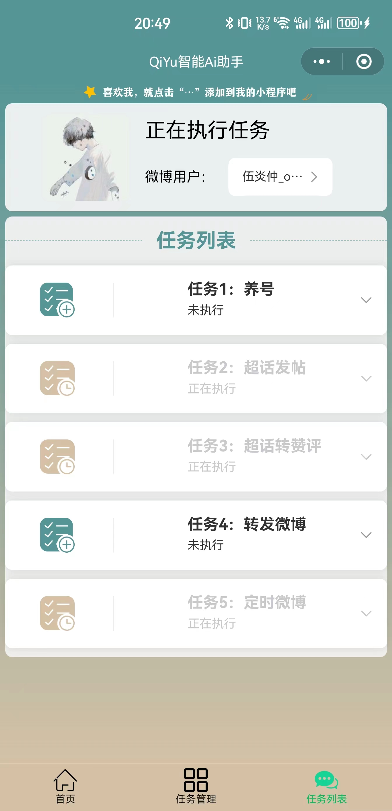 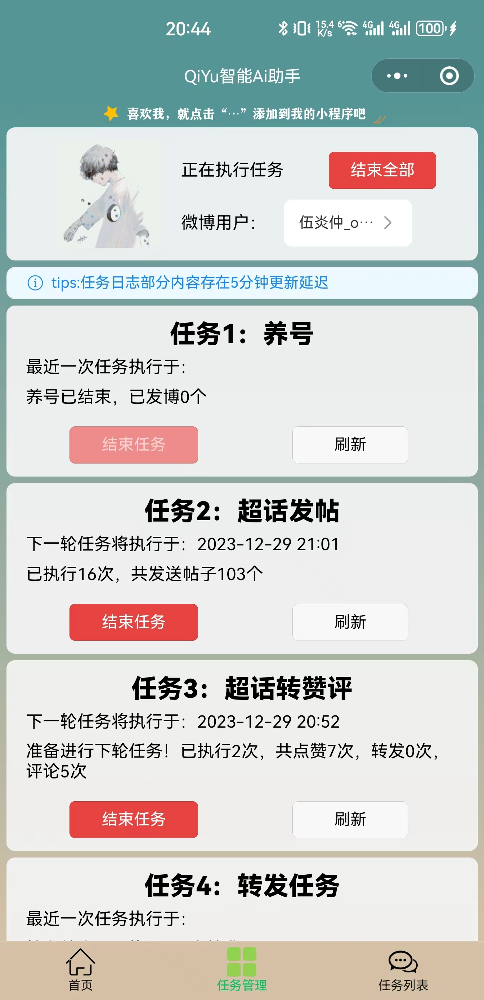 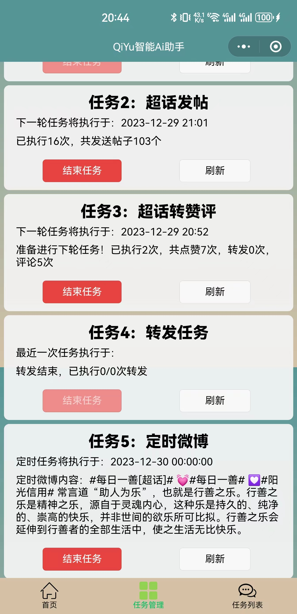

### 可选择的任务及其任务面板

  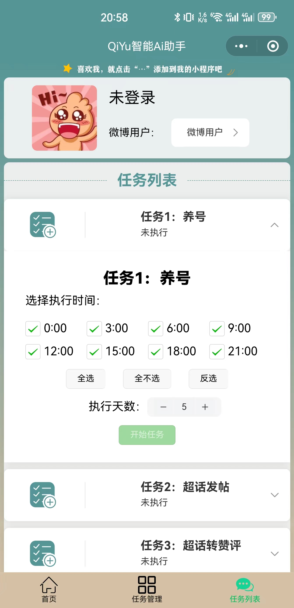 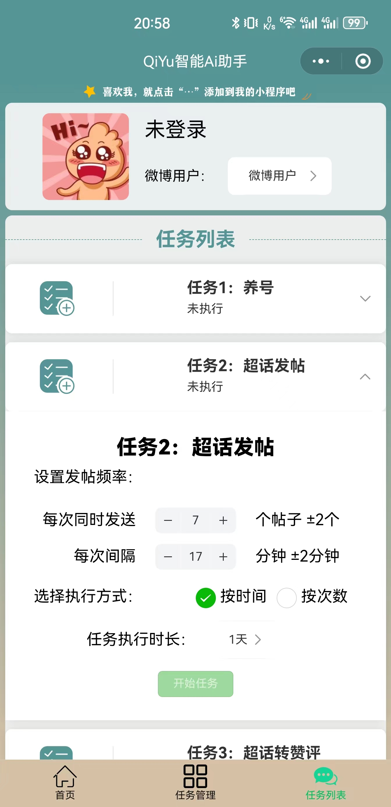 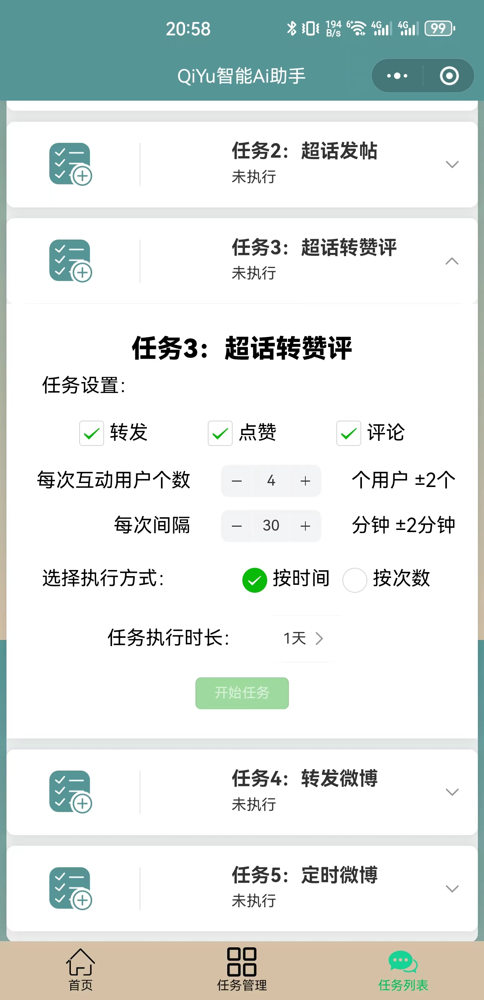

  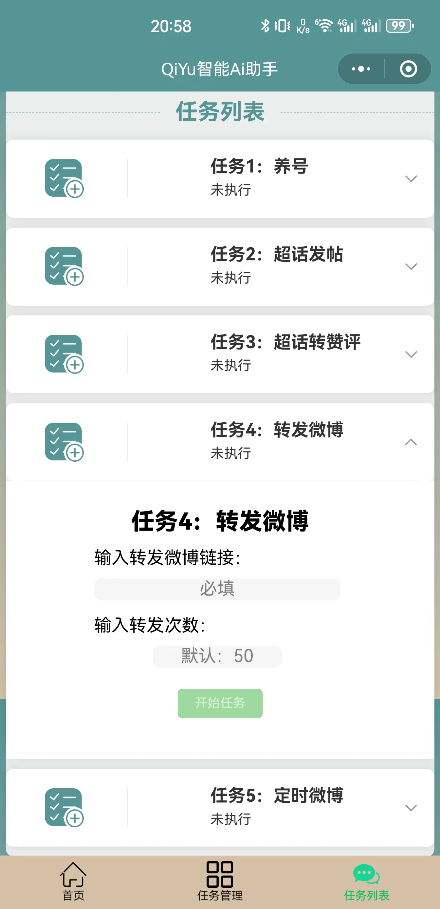 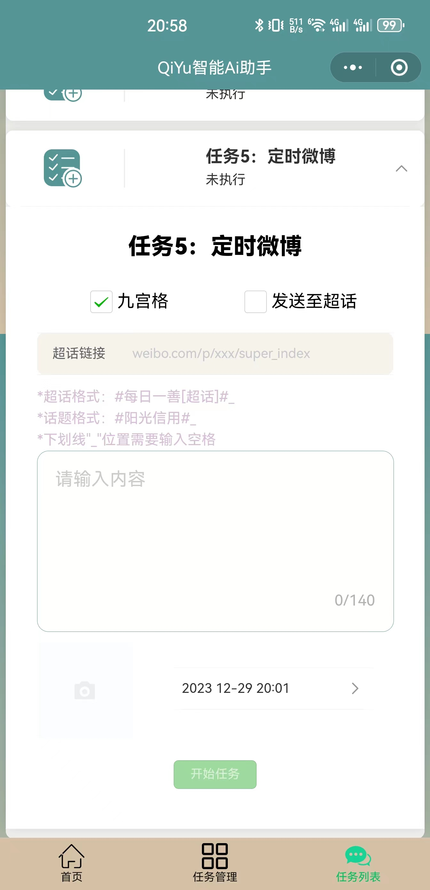

